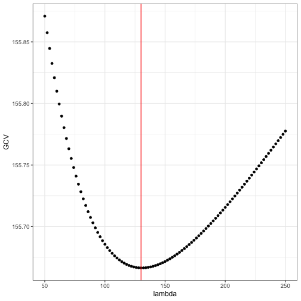
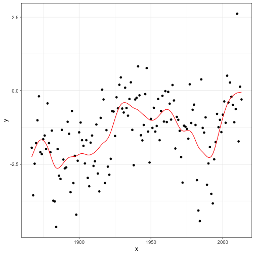
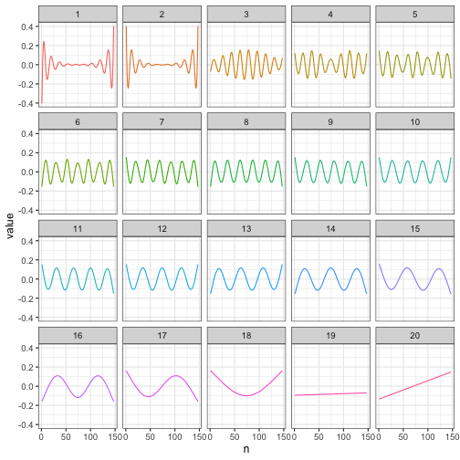
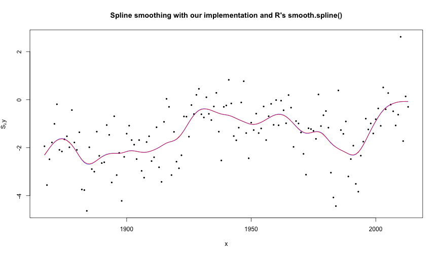
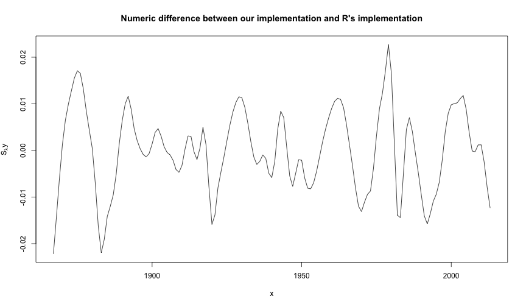

slides
========================================================
author: 
date: 
autosize: true
width: 1440
height: 900


To-do
========================================================

- Implement a smoothing spline smoother using LOOCV for selecting the tuning parameter $\lambda$.

- Using B-spline basis functions and their derivatives from `splines::splineDesign`

- Test implementation and compare with `smooth.spline`.

- Test on real data and simulated data (benchmarking, profiling)

Use matrix decompositions to speed up LOOCV.

Link to CSwR chapter: [Bivariate smoothing](https://cswr.nrhstat.org/3-bivariate.html).

Splines
========================================================

Given points $\{(x_1,y_1), \dots, (x_n, y_n)\}$, we want to implement the smoother which solves
\[
\min_{f \in C^2}\quad L(f) = \sum_{i=1}^n\big(y_i - f(x_i)\big)^2 + \lambda \|f''\|_2^2
\]
All solutions belong to the $n$-dimensional vector space consisting of cubic splines with knots in $\mathbf x = (x_1, \dots, x_n)$, independently of $\mathbf y$. Thus all candidate solutions can be written
\[
f = \sum_{i=1}^n \beta_i \varphi_i
\]
for a basis $\varphi_1, \dots, \varphi_n$ of cubic splines.

Splines
========================================================

More concisely $\mathbf f = \boldsymbol \Phi \beta$ for $\mathbf f = (f(x_1), \dots, f(x_n))$ and $\boldsymbol \Phi_{ij} = \varphi_j(x_i)$. We use this to rewrite the loss function as
\[
L(f) = (\mathbf y - \boldsymbol \Phi\beta)'(\mathbf y - \boldsymbol \Phi\beta) + \lambda\beta'\boldsymbol \Omega\beta
\]
where
\[
\boldsymbol \Omega_{ij} = \langle\varphi_i'', \varphi_j''\rangle = \int \varphi_i''\varphi_j''\, dm.
\]
The minimizer is given by
\[
\hat{\mathbf{f}} = \boldsymbol\Phi(\boldsymbol\Phi'\boldsymbol\Phi + \lambda\boldsymbol\Omega)^{-1}\boldsymbol\Phi'\mathbf y \equiv \mathbf S_\lambda\mathbf y.
\]
We must overcome two computational challenges, namely 1) how to evaluate $\boldsymbol\Omega$ and 2) how to efficiently calculate $\mathbf S_{\lambda}$.

Penalty matrix
========================================================

From CSwR, using Simpson's rule:


```r
pen_mat <- function(inner_knots) {
  knots <- sort(c(rep(range(inner_knots), 3), inner_knots))
  d <- diff(inner_knots)  # The vector of knot differences; b - a 
  g_ab <- splineDesign(knots, inner_knots, derivs = 2) 
  knots_mid <- inner_knots[-length(inner_knots)] + d / 2
  g_ab_mid <- splineDesign(knots, knots_mid, derivs = 2)
  g_a <- g_ab[-nrow(g_ab), ]
  g_b <- g_ab[-1, ]
  (crossprod(d * g_a,  g_a) + 
      4 * crossprod(d * g_ab_mid, g_ab_mid) + 
      crossprod(d * g_b, g_b)) / 6 
}
```

Simple smoother function
========================================================
We are now ready to write our first (slow) smoother function (using GCV as oppossed to LOOCV):


```r
Phi <- splineDesign(c(rep(range(x), 3), x), x)
Omega <- pen_mat(x)
  
smoother <- function(lambda) {
  Phi %*% solve(
    crossprod(Phi) + lambda * Omega, 
    t(Phi) %*% y
  )
}
```

Simple smoother function
========================================================


```r
gcv <- function(lambda) {
  S <- Phi %*% solve(crossprod(Phi) + lambda * Omega, t(Phi))
  df <- sum(diag(S))  # The trace of the smoother matrix
  sum(((y - S %*% y) / (1 - df / length(y)))^2, na.rm = TRUE) 
}

lambda <- seq(50, 250, 2)
GCV <- sapply(lambda, gcv)
lambda_opt <- NULL
lambda_opt$gcv <- lambda[which.min(GCV)]
```


Simple smoother function
========================================================


Simple smoother function
========================================================
We can test that this works:




Efficient computation
========================================================
Steps for efficient calculation of $\mathbf S_\lambda = \boldsymbol\Phi(\boldsymbol\Phi'\boldsymbol\Phi + \lambda\boldsymbol\Omega)^{-1}\boldsymbol\Phi'$

1. Single-value decomposition $\Phi = UDV'$.

2. Diagonalize the matrix $D^{-1}V'\Phi VD^{-1} = W\Gamma W'$.

3. Then 
$$
\mathbf S_\lambda = \widetilde U(I + \lambda \Gamma)^{-1}\widetilde U'
$$
for $\widetilde U = UW$.

Step-by-step version for implementation:

- First, the coefficients $\hat\beta = \widetilde U'y$ are computed for expanding $y$ in the basis given by the columns of $\widetilde U$.

- Second, the $i$-th coefficient is shrunk towards $0$,
\[
\hat\beta_i(\lambda) = \frac{\hat\beta_i}{1+\lambda\gamma_i}.
\]

- Third, the smoothed values $\widetilde U\hat\beta_i(\lambda)$ are computed as an expansion using the shrunken coefficients.

Efficient computation: Example
========================================================

```r
p <- 20
inner_knots <- seq(min(x), max(x), length.out = p-2)
Phi <- splineDesign(c(rep(range(inner_knots), 3), inner_knots), x)
Omega <- pen_mat(inner_knots)

Phi_svd <- svd(Phi)
Omega_tilde <- t(crossprod(Phi_svd$v, Omega %*% Phi_svd$v)) / Phi_svd$d
Omega_tilde <- t(Omega_tilde) / Phi_svd$d
Omega_tilde_svd <- svd(Omega_tilde)  
U_tilde <- Phi_svd$u %*% Omega_tilde_svd$u

# Decomposition, but fast
f_hat <- t(U_tilde) %*% y
f_hat <- f_hat / (1 + lambda_opt$gcv*Omega_tilde_svd$d)
f_hat <- U_tilde %*% f_hat
```

Efficient computation: Example
========================================================


Spline divergence
========================================================
When $n < p$, the decomposition does not hold! This is why the splines diverge.



Spline smoothing with LOOCV
========================================================
We now implement spline smoothing with objective function for determining tuning parameter $\lambda$ being LOOCV. 


```r
myLoocv <- function(x,y,
  p, #number of splines where p <n 
  interval, #interval in which to search for tuning parameter
  optimize = TRUE, #whether to optimize or not
  lambda = NULL #lambda value to compute with given we do not optimize
) {
  # ....
  # Spline design and matrix computations including the penalty matrix goes here
  # ....
  #Implementation of smoother matrix and leave-one-out cross-validation from 3.1.3
  smoother <- function(lambda, n) U_tilde %*% solve(diag(n) + lambda * diag(Gamma)) %*% t(U_tilde)
  obj <- function(lambda, n) {
    S <- smoother(lambda, n)
    sum(((y - S %*% y) / (1 - diag(S)))^2)
  }
  #Minimizing LOOCV in interval
  if(optimize == TRUE){lambda <- optimize(obj, interval, n = n)$minimum}
  list(x = x, y = y, f_hat = c(smoother(lambda, n) %*% y), inner_knots = inner_knots, lambda = lambda)
}
```


Spline smoothing with LOOCV
========================================================
Comparing with `smooth.spline`, we supply the argument `cv = TRUE` such that it uses LOOCV as well.
Had it used GCV, our results may differ widely.

```r
#Using LOOCV 
p <- 50
mySmooth <- myLoocv(x, y, p, c(1, 100))
smooth <- smooth.spline(x, y, cv = TRUE, nknots = p - 2)
```
Another thing to keep in mind is the number of splines being used `nknots`. 
Given we want $p$ splines, we supply `knots` with the value `p - 2`, though we could simply use the algorithm that `smooth.spline` uses to select the amount of knots, `.nknots.smspl`.

Spline smoothing with LOOCV
========================================================



Spline smoothing with LOOCV: Difference
========================================================


```
[1] -0.02219169  0.02276205
```

Spline smoothing with LOOCV: Performance
========================================================
We expect our method to be much slower than that of `smooth.spline`.
This has mainly to do with it using Fortran while we are left with R's native matrix computations. 
Using `microbenchmark`, we are able to measure their computation speeds on simulated data and plot them.
Since we are not to test for their root-search efficiency, we will supply these beforehand. 

```r
#Simulated data
n <- 1000
x <- 1:n 
y <- c(0, cumsum(rnorm(n-1, sd = 0.6)))
lambda_opt <- c(myLoocv(x, y, p, c(1, 200))$lambda, smooth.spline(x, y, cv = TRUE, nknots = p - 2)$lambda)

#Plot of computation times
myBench <- microbenchmark("Our implementation" = myLoocv(x, y, p, c(1, 200), optimize = FALSE, lambda = lambda_opt[1]),
                          "R's implementation" = smooth.spline(x, y, cv = TRUE, nknots = p - 2, lambda = lambda_opt[2]))
```

Spline smoothing with LOOCV: Performance (p)
========================================================
As foreseen, our method is much less efficient than `smooth.spline`.
We continue the comparison by seeing the methods performance for different number of splines $p$. 

Median time complexity of our method seems quadratic at best while that of `smooth.spline()` is linear. 
This is of no suprise as we are computing the smoothing matrix (Matrix multiplication).

Spline smoothing with LOOCV: Performance (n)
========================================================


Likewise we see that time complexity is at least quadratic for our solution and linear at worst for R's `smooth.spline`, though this comparisson is troublesome by the requirement $n < p$. 

In conclusion, using techniques from linear algebra and calculus we have been able to create spline smoothing method that can mimic the results of `smooth.spline` using LOOCV as our criterion.
Though the method takes up far to much computation time to be considered viable, this may be improved upon by implementing it in C++ using the `eigen` header files for SVD decomposition. 
One should note that we require substantially less computing time if $p$ is low.


