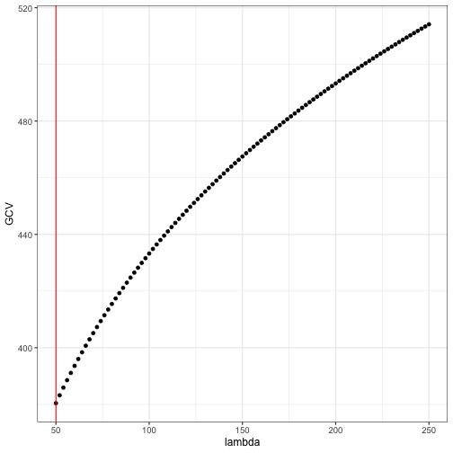

Bivariate Smoothing
========================================================
author: Viktor Bluhme Jeppesen and Malte Nikolajsen
date: 17 September 2020
autosize: true
width: 1440
height: 900


To-do
========================================================

- Implement a smoothing spline smoother using LOOCV for selecting the tuning parameter $\lambda$.

- Using B-spline basis functions and their derivatives from `splines::splineDesign`

- Test implementation and compare with `smooth.spline`.

- Test on real data and simulated data (benchmarking, profiling)

Use matrix decompositions to speed up LOOCV.

Link to CSwR chapter: [Bivariate smoothing](https://cswr.nrhstat.org/3-bivariate.html).

Splines
========================================================

Given points $\{(x_1,y_1), \dots, (x_n, y_n)\}$, we want to implement the smoother which solves
\[
\min_{f \in C^2}\quad L(f) = \sum_{i=1}^n\big(y_i - f(x_i)\big)^2 + \lambda \|f''\|_2^2
\]
All solutions belong to the $n$-dimensional vector space consisting of cubic splines with knots in $\mathbf x = (x_1, \dots, x_n)$, independently of $\mathbf y$. Thus all candidate solutions can be written
\[
f = \sum_{i=1}^n \beta_i \varphi_i
\]
for a basis $\varphi_1, \dots, \varphi_n$ of cubic splines.

Splines
========================================================

More concisely $\mathbf f = \boldsymbol \Phi \beta$ for $\mathbf f = (f(x_1), \dots, f(x_n))$ and $\boldsymbol \Phi_{ij} = \varphi_j(x_i)$. We use this to rewrite the loss function as
\[
L(f) = (\mathbf y - \boldsymbol \Phi\beta)'(\mathbf y - \boldsymbol \Phi\beta) + \lambda\beta'\boldsymbol \Omega\beta
\]
where
\[
\boldsymbol \Omega_{ij} = \langle\varphi_i'', \varphi_j''\rangle = \int \varphi_i''\varphi_j''\, dm.
\]
The minimizer is given by
\[
\hat{\mathbf{f}} = \boldsymbol\Phi(\boldsymbol\Phi'\boldsymbol\Phi + \lambda\boldsymbol\Omega)^{-1}\boldsymbol\Phi'\mathbf y \equiv \mathbf S_\lambda\mathbf y.
\]
Challenges:

- How to evaluate $\boldsymbol\Omega$

- How to choose smoothing parameter $\lambda$

- How to efficiently calculate $\mathbf S_{\lambda}$.

Penalty matrix
========================================================

With $g_{ij} = \phi_i'' \phi_j''$, it holds for two consecutive knots $a$ and $b$ that
\[
\int_a^b g_{ij}(x)dx = \frac{b-a}{6}\left(g_{ij}(a) + g_{ij}\left(\frac{a+b}{2}\right) + g_{ij}(b)\right)
,\]
so $\boldsymbol \Omega_{ij}$ can be evaluated exactly.

Code for this computation can be found in CSwR.


Efficient computation
========================================================
Steps for efficient calculation of $\mathbf S_\lambda = \boldsymbol\Phi(\boldsymbol\Phi'\boldsymbol\Phi + \lambda\boldsymbol\Omega)^{-1}\boldsymbol\Phi'$

1. Single-value decomposition $\Phi = UDV'$.

2. Diagonalize the matrix $D^{-1}V'\Phi VD^{-1} = W\Gamma W'$.

3. Then 
$$
\mathbf S_\lambda = \widetilde U(I + \lambda \Gamma)^{-1}\widetilde U'
$$
for $\widetilde U = UW$.

In practise: 

- Calculate $\hat\beta = \widetilde U' y$
- Shrink towards zero, $\hat\beta_i(\lambda) = \frac{\hat\beta_i}{1+\lambda \gamma_i}$
- Calculate $\hat{\mathbf{f}} = \widetilde U \hat\beta(\lambda)$.

Note: Shrink in orthonormal basis given by columns of $\widetilde U$.

Efficient computation: Example
========================================================

```r
my_first_smoother <- function(lambda, x, y, p) {
  inner_knots <- seq(min(x), max(x), length.out = p-2)
  Phi <- splineDesign(c(rep(range(inner_knots), 3), inner_knots), x)
  Omega <- pen_mat(inner_knots)
  
  Phi_svd <- svd(Phi)
  Omega_tilde <-
    t(crossprod(Phi_svd$v, Omega %*% Phi_svd$v)) / Phi_svd$d
  Omega_tilde <- t(Omega_tilde) / Phi_svd$d
  Omega_tilde_svd <- svd(Omega_tilde)  
  U_tilde <- Phi_svd$u %*% Omega_tilde_svd$u
  
  f_hat <- t(U_tilde) %*% y
  f_hat <- f_hat / (1 + lambda*Omega_tilde_svd$d)
  f_hat <- U_tilde %*% f_hat
  
  return(f_hat)
}
```

Efficient computation: Example
========================================================

Different values of $\lambda$ give different levels of smoothness. Here for $\lambda = 1, 50, 1000$.


Choice of λ
========================================================

We use LOOCV (Leave-One-Out Cross Validation), minimizing
\[
\mathrm{LOOCV} = \sum_{i=1}^n (y_i - \hat{\mathbf{f}}_i^{-i})^2 = \sum_{i=1}^n\left(\frac{y_i - \hat{\mathbf{f}}_i}{1 - \mathbf S_{ii}}\right)
\]
over $\lambda$.

Problem: This requires the diagonal of $\mathbf S$, which requires the computation of $\mathbf S$.

Much easier if $\mathbf S_{ii}$ replaced by $\mathrm{tr}(\mathbf S) / n$, since
\[
\mathrm{tr}(\mathbf S) = \sum_{i=1}^n \frac{1}{1+\lambda \gamma_i}
,\]
This is *Generalized Cross Validation* (GCV).


LOOCV vs. GCV
========================================================

When $\lambda$ value is given, decompositions provide little speedup.

But GCV is much faster than LOOCV for optimizing — we don't need $\mathbf S_\lambda$

Using `bench::mark()` on `Nuuk_year` data.


```
# A tibble: 4 x 6
  expression           min   median `itr/sec` mem_alloc `gc/sec`
  <bch:expr>      <bch:tm> <bch:tm>     <dbl> <bch:byt>    <dbl>
1 LOOCV (λ given)   4.04ms   5.61ms      145.     1.1MB     2.05
2 GCV (λ given)     3.56ms   4.13ms      226.    1.32MB     6.46
3 LOOCV (opt)       4.66ms   5.51ms      171.    1.84MB     6.59
4 GCV (opt)         4.04ms   4.36ms      217.     1.2MB     6.58
```

With great displeasure, we move forward with LOOCV..

Spline smoothing with LOOCV
========================================================
We now implement spline smoothing with objective function for determining tuning parameter $\lambda$ being LOOCV. 

```r
myLoocv <- function(x,y,
  p, #number of splines where p < n 
  interval, #interval in which to search for tuning parameter
  optimize = TRUE, #whether to optimize or not
  lambda = NULL #lambda value to compute with given we do not optimize
) {
  # ....
  # Spline design and matrix computations including the penalty matrix goes here
  # ....
  #Implementation of smoother matrix and leave-one-out cross-validation from 3.1.3
  smoother <- function(lambda, n) U_tilde %*% solve(diag(n) + lambda * diag(Gamma)) %*% t(U_tilde)
  obj <- function(lambda, n) {
    S <- smoother(lambda, n)
    sum(((y - S %*% y) / (1 - diag(S)))^2)
  }
  #Minimizing LOOCV in interval
  if(optimize == TRUE){lambda <- optimize(obj, interval, n = n)$minimum}
  list(x = x, y = y, f_hat = c(smoother(lambda, n) %*% y), inner_knots = inner_knots, lambda = lambda)
}
```


Spline smoothing with LOOCV
========================================================
Comparing with `smooth.spline`, we supply the argument `cv = TRUE` such that it uses LOOCV as well.
Had it used GCV, our results may differ widely.

```r
#Using LOOCV 
p <- 50
mySmooth <- myLoocv(x, y, p, c(1, 100))
smooth <- smooth.spline(x, y, cv = TRUE, nknots = p - 2)
```
Another thing to keep in mind is the number of splines being used `nknots`. 
Given we want $p$ splines, we supply `knots` with the value `p - 2`, though we could simply use the algorithm that `smooth.spline` uses to select the amount of knots, `.nknots.smspl`.

Spline smoothing with LOOCV
========================================================


Spline smoothing with LOOCV: Difference
========================================================


```
[1] -0.10383021  0.07816409
```

Spline smoothing with LOOCV: Performance
========================================================
We expect our method to be much slower than that of `smooth.spline`.
This has mainly to do with it using Fortran while we are left with R's native matrix computations. 
Using `microbenchmark`, we are able to measure their computation speeds on simulated data and plot them.
Since we are not to test for their root-search efficiency, we will supply these beforehand. 

```r
#Simulated data
n <- 1000
x <- 1:n 
y <- c(0, cumsum(rnorm(n-1, sd = 0.6)))
lambda_opt <- c(myLoocv(x, y, p, c(1, 200))$lambda, smooth.spline(x, y, cv = TRUE, nknots = p - 2)$lambda)

#Plot of computation times
myBench <- microbenchmark("Our implementation" = myLoocv(x, y, p, c(1, 200), optimize = FALSE, lambda = lambda_opt[1]),
                          "R's implementation" = smooth.spline(x, y, cv = TRUE, nknots = p - 2, lambda = lambda_opt[2]))
```

Spline smoothing with LOOCV: Performance (p)
========================================================
As foreseen, our method is much less efficient than `smooth.spline`.
We continue the comparison by seeing the methods performance for different number of splines $p$. 

Median time complexity of our method seems quadratic at best while that of `smooth.spline()` is linear. 
This is of no suprise as we are computing the smoothing matrix (Matrix multiplication).

Spline smoothing with LOOCV: Performance (n)
========================================================


Likewise we see that time complexity is at least quadratic for our solution and linear at worst for R's `smooth.spline`, though this comparisson is troublesome by the requirement $n < p$. 

In conclusion, using techniques from linear algebra and calculus we have been able to create spline smoothing method that can mimic the results of `smooth.spline` using LOOCV as our criterion.
Though the method takes up far to much computation time to be considered viable, this may be improved upon by implementing it in C++ using the `eigen` header files for SVD decomposition. 
One should note that we require substantially less computing time if $p$ is low.


APPENDIX Simple smoother function
========================================================
We are now ready to write our first (slow) smoother function (using GCV as oppossed to LOOCV):


```r
Phi <- splineDesign(c(rep(range(x), 3), x), x)
Omega <- pen_mat(x)
  
smoother <- function(lambda) {
  Phi %*% solve(
    crossprod(Phi) + lambda * Omega, 
    t(Phi) %*% y
  )
}
```

Simple smoother function
========================================================


```r
gcv <- function(lambda) {
  S <- Phi %*% solve(crossprod(Phi) + lambda * Omega, t(Phi))
  df <- sum(diag(S))  # The trace of the smoother matrix
  sum(((y - S %*% y) / (1 - df / length(y)))^2, na.rm = TRUE) 
}

lambda <- seq(50, 250, 2)
GCV <- sapply(lambda, gcv)
lambda_opt <- NULL
lambda_opt$gcv <- lambda[which.min(GCV)]
```


Simple smoother function
========================================================


Simple smoother function
========================================================
We can test that this works:


```
processing file: slides.Rpres
── Attaching packages ─────────────────────────────────────────────── tidyverse 1.3.0 ──
✓ ggplot2 3.3.2     ✓ purrr   0.3.4
✓ tibble  3.0.3     ✓ dplyr   1.0.0
✓ tidyr   1.1.0     ✓ stringr 1.4.0
✓ readr   1.3.1     ✓ forcats 0.5.0
── Conflicts ────────────────────────────────────────────────── tidyverse_conflicts() ──
x dplyr::filter() masks stats::filter()
x dplyr::lag()    masks stats::lag()
Parsed with column specification:
cols(
  Year = col_double(),
  `1` = col_double(),
  `2` = col_double(),
  `3` = col_double(),
  `4` = col_double(),
  `5` = col_double(),
  `6` = col_double(),
  `7` = col_double(),
  `8` = col_double(),
  `9` = col_double(),
  `10` = col_double(),
  `11` = col_double(),
  `12` = col_double()
)
`summarise()` ungrouping output (override with `.groups` argument)
Quitting from lines 445-446 (slides.Rpres) 
Fejl: Aesthetics must be either length 1 or the same as the data (147): y
Backtrace:
     █
  1. └─knitr::knit("slides.Rpres", output = "slides.md", encoding = "UTF-8")
  2.   └─knitr:::process_file(text, output)
  3.     ├─base::withCallingHandlers(...)
  4.     ├─knitr:::process_group(group)
  5.     └─knitr:::process_group.block(group)
  6.       └─knitr:::call_block(x)
  7.         └─knitr:::block_exec(params)
  8.           ├─knitr:::in_dir(...)
  9.           └─knitr:::evaluate(...)
 10.             └─evaluate::evaluate(...)
 11.               └─evaluate:::evaluate_call(...)
 12.                 ├─base:::handle(...)
 13.                 ├─base::withCallingHandlers(...)
 14.                 ├─base::withVisible(value_fun(ev$value, ev$visible))
 15.                 └─knitr:::value_fun(ev$value, ev$visible)
 16.                   └─knitr:::fun(x, options = options)
 17.                     ├─base::withVisible(knit
Kørsel stoppet
```
